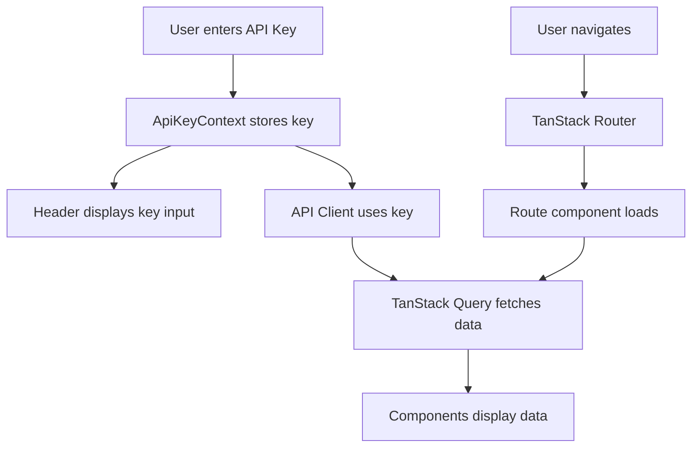
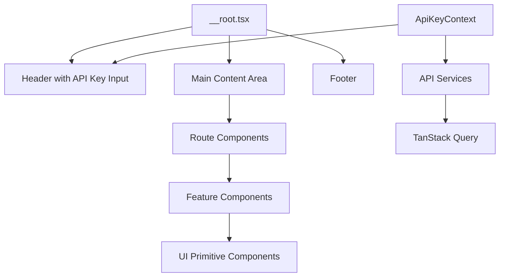

# CourseForge Explorer - Additional Context for AI Agents

This document provides additional context, architectural decisions, and reference patterns for AI agents working on this project.

## Project Purpose

CourseForge Explorer is a browser tool that allows users to:
1. Enter their CourseForge API key in a persistent header field
2. Navigate and explore CourseForge content (games, mods, files)
3. View all available information from the API (IDs, download URLs, metadata, etc.)
4. Browse content in an organized, user-friendly interface

## Architecture Overview

### Data Flow



### Component Hierarchy



## Key Architectural Decisions

### 1. API Key Management
- **Decision**: Use React Context for global API key state
- **Rationale**: API key needs to be accessible throughout the app without prop drilling
- **Implementation**: `store/ApiKeyContext.tsx` provides the API key to all components
- **Pattern**: Context provider wraps the app, hook (`useApiKey`) provides easy access

### 2. Data Fetching Strategy
- **Decision**: TanStack Query for all remote data
- **Rationale**: Built-in caching, error handling, loading states, and automatic refetching
- **Implementation**: All API calls go through TanStack Query hooks
- **Pattern**: Query keys include API key to invalidate cache when key changes

### 3. File-Based Routing
- **Decision**: TanStack Router with file-based routing
- **Rationale**: Easier to understand project structure, co-location of route code
- **Implementation**: Routes defined in `src/routes/` directory structure
- **Pattern**: Use lazy loading for route components to improve initial load time

### 4. Component Organization
- **Decision**: Atomic design with primitive UI components
- **Rationale**: Reusability, consistency, easier maintenance
- **Implementation**: 
  - Primitives in `components/ui/`
  - Features in `features/`
  - Layout in `components/layout/`
- **Pattern**: Build primitives first, compose into features

## Common Patterns

### API Service Pattern
```typescript
// src/api/courseforge.ts
import { createApiClient } from './client';

export const courseforgeApi = {
  getGames: async (apiKey: string) => {
    const client = createApiClient(apiKey);
    const response = await client.get('/games');
    return response.data;
  },
  
  getGame: async (apiKey: string, gameId: string) => {
    const client = createApiClient(apiKey);
    const response = await client.get(`/games/${gameId}`);
    return response.data;
  },
  
  // ... more endpoints
};
```

### Custom Hook Pattern
```typescript
// src/hooks/useCourseForgeGames.ts
import { useQuery } from '@tanstack/react-query';
import { useApiKey } from './useApiKey';
import { courseforgeApi } from '../api/courseforge';

export const useCourseForgeGames = () => {
  const apiKey = useApiKey();
  
  return useQuery({
    queryKey: ['games', apiKey],
    queryFn: () => courseforgeApi.getGames(apiKey),
    enabled: !!apiKey,
  });
};
```

### Route Component Pattern
```typescript
// src/routes/games/index.tsx
import { createFileRoute } from '@tanstack/react-router';
import { GamesList } from '../../features/games/GamesList';

export const Route = createFileRoute('/games/')({
  component: GamesList,
});
```

### Primitive Component Pattern
```typescript
// src/components/ui/Button.tsx
import { ButtonHTMLAttributes, forwardRef } from 'react';
import { cn } from '../../utils/cn';

interface ButtonProps extends ButtonHTMLAttributes<HTMLButtonElement> {
  variant?: 'primary' | 'secondary' | 'outline';
}

export const Button = forwardRef<HTMLButtonElement, ButtonProps>(
  ({ className, variant = 'primary', ...props }, ref) => {
    return (
      <button
        ref={ref}
        className={cn(
          'px-4 py-2 rounded-md font-medium',
          variant === 'primary' && 'bg-blue-600 text-white',
          variant === 'secondary' && 'bg-gray-600 text-white',
          variant === 'outline' && 'border border-gray-300',
          className
        )}
        {...props}
      />
    );
  }
);
```

## Project Structure Details

### API Layer (`src/api/`)
- **client.ts**: Factory function that creates configured API client with API key
- **courseforge.ts**: All CourseForge API endpoint definitions
- **types.ts**: TypeScript interfaces for API requests/responses

### Components (`src/components/`)
- **ui/**: Primitive, reusable components (Button, Input, Card, Badge, Spinner, etc.)
- **layout/**: Structural components (Header with API key input, Footer)

### Features (`src/features/`)
- **games/**: Game-related components (GamesList, GameCard, GameDetails)
- **mods/**: Mod-related components (ModsList, ModCard, ModDetails)
- **files/**: File-related components (FilesList, FileCard, FileDownload)

### Hooks (`src/hooks/`)
- **useApiKey.ts**: Hook to access API key from context
- **useCourseForge*.ts**: Custom hooks for specific API queries
- **useDebounce.ts**: Utility hook for debouncing (e.g., search inputs)

### Routes (`src/routes/`)
- **__root.tsx**: Root layout with Header, Footer, and Outlet
- **index.lazy.tsx**: Homepage (lazy loaded)
- **games/**: Game routes (index, $gameId)
- **mods/**: Mod routes (index, $modId)
- **files/**: File routes (index, $fileId)

### Store (`src/store/`)
- **ApiKeyContext.tsx**: React Context for API key management
- **ApiKeyProvider.tsx**: Provider component that wraps the app

## Development Workflows

### Adding a New Route
1. Create route file in `src/routes/` following TanStack Router conventions
2. Create feature component in `src/features/` if needed
3. Use existing UI primitives from `components/ui/`
4. Create custom hook in `src/hooks/` for data fetching
5. Add API service method in `src/api/courseforge.ts` if new endpoint needed

### Adding a New API Endpoint
1. Define TypeScript types in `src/types/courseforge.ts`
2. Add service method in `src/api/courseforge.ts`
3. Create custom hook in `src/hooks/` that uses TanStack Query
4. Use the hook in components that need the data

### Creating a New UI Component
1. Check if similar primitive exists in `components/ui/`
2. If not, create new primitive component with proper TypeScript types
3. Use Tailwind CSS for styling
4. Make it reusable and composable
5. Export from `components/ui/index.ts` for cleaner imports

## Important Notes

### API Key Handling
- Always check if API key exists before making API calls
- Show user-friendly error messages when API key is missing or invalid
- Store API key in context, not in localStorage (unless user explicitly requests persistence)

### Error Handling
- Use TanStack Query's error states for API errors
- Show loading states during data fetching
- Implement error boundaries for React error handling
- Never leave error states unhandled

### Performance
- Use lazy loading for route components
- Implement proper query caching with TanStack Query
- Use React.memo for expensive components when needed
- Optimize images and assets

### Accessibility
- Use semantic HTML elements
- Provide proper ARIA labels where needed
- Ensure keyboard navigation works
- Maintain proper focus management

## Testing Considerations

While not explicitly in scope, when adding tests:
- Test API integration with mocked API client
- Test components in isolation
- Test routing behavior
- Test error handling scenarios

## Deployment Checklist

Before deploying to GitHub Pages:
1. Verify `vite.config.ts` has correct base path
2. Test all routes work with base path
3. Ensure API key input works correctly
4. Test error handling for invalid API keys
5. Verify all assets load correctly
6. Test responsive design on mobile devices
